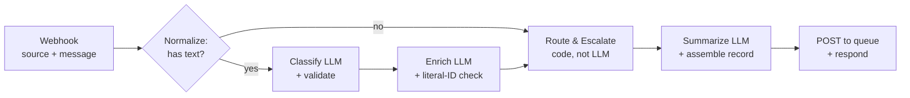

# ArcVault Intake & Triage: architecture

## 1. System design

- **Trigger:** an n8n Cloud Webhook receives `{source, message}`. Email, form and portal integrations would all post here. One execution handles one message.
- **LLM steps:** there are three Groq calls (`openai/gpt-oss-120b`, temperature 0, JSON mode). Each is a plain HTTP Request node followed by a Code node that validates the response. I chose HTTP nodes over AI Agent nodes so the request body is explicit and the provider is just a base URL in config. I used gpt-oss-120b because `llama-3.3-70b-versatile` isn't available on the free tier, and it's the strongest model my key can access.
- **The LLM labels, code decides.** Routing and escalation are a pure, unit-tested function (`src/rules.js`), and every threshold and keyword lives in `config/rules.json`. Routing is therefore deterministic and auditable, and changing a rule is a config edit, not a prompt change.
- **Where state lives:** the workflow is stateless between messages. Each record exists in (1) the n8n execution history, with every node's input and output, (2) Webhook.site at `/<destination_queue>`, standing in for the queue system, and (3) the HTTP response, which the caller writes to `output/records.jsonl`; `records.json` is built from that file and schema-checked.
- **One source of truth:** `scripts/build_workflow.py` generates the n8n JSON and PROMPTS.md from `prompts/`, `config/` and `src/`, so the docs, the tests and the deployed workflow can't drift apart.

## 2. Routing

| Category | Queue | Why |
|---|---|---|
| Bug Report | `engineering` | A code fix for one user or feature |
| Incident/Outage | `incident_response` | On-call/SRE, a different response time from a bug |
| Billing Issue | `billing` | Finance can act on invoices; engineering can't |
| Feature Request | `product` | Roadmap input, not a support ticket |
| Technical Question | `technical_support` | How-to and configuration, usually answered from docs |
| any escalation (section 3) | `human_review_escalation` | Fallback for low confidence and high risk |

I split Bug from Incident because that boundary decides whether someone gets paged. Every record keeps both `standard_queue` (the owner by category) and `destination_queue` (where it actually went), so whoever picks up an escalated ticket knows who to hand it to.

## 3. Escalation

A record escalates if **any** rule fires. Every rule that fires is recorded with a readable reason.

| Rule | Fires when | Why |
|---|---|---|
| `low_confidence` | confidence < 0.70 | The brief requires it. Weak on its own, because LLM confidence is poorly calibrated. |
| `multi_intent` | classifier lists `secondary_categories` | Added after testing: a three-request message scored 0.92. One ticket can't sit in two queues. |
| `incident_category` | category is Incident/Outage | High impact; a person confirms scope before paging. Works in any language. |
| `outage_language` | phrase match on raw text ("outage", "stopped loading", "multiple users affected"...) | Doesn't depend on the LLM, so an outage mislabelled as a Bug still escalates. Multi-word phrases only, to avoid false positives on words like "everyone". |
| `billing_amount_over_threshold` | Billing Issue with a $ amount > $500 | Amounts are regex-parsed from the raw text, so a hallucinated number can't trigger or suppress it. |
| `llm_failure` | an LLM call fails or its output fails validation after one retry | Never drop a message. Failed classification gives `standard_queue: unassigned`. |

**The $500 interpretation.** In message #3 the invoice is $1,240 against a $980 contract rate, so the error itself is $260. I escalate when **any amount in the dispute** exceeds $500: a wrong invoice over $500 is a material document a person should check. The stricter reading (`"discrepancy"`) is a one-line config change and is unit-tested; under it, #3 would go to `billing` unescalated. This is the call I'd most expect a reviewer to push back on.

**Security signal raises priority but doesn't escalate.** Access failures (401/403, "locked out") set priority to High and are recorded as an advisory signal. A single user's 403 (message #1) is routine engineering work, and escalating every login problem would flood the human queue. Widespread failures are caught by the outage rules. A mention of SSO in a question (message #4) isn't a signal at all.

**Results** ([eval report](../output/eval_report.md)). All 5 samples match my pre-written expectations, identically across 3 runs. The edge cases pass 6/8: injection was ignored, French was handled, and multi-intent and empty messages escalated. The two misses: "it's broken again" scored 0.78 and wasn't escalated, and an angry $45 complaint got High priority but was still routed correctly.

## 4. At production scale

- **Reliability:** put a durable queue (SQS or Pub/Sub) in front of n8n, with a dead-letter queue for records that fail twice. Deduplicate on a hash of the message, since email clients and webhooks retry. Use exponential backoff that honours `retry-after`. Replace Webhook.site with the ticketing API, using idempotency keys.
- **Cost:** about 6k tokens per message. Merge classification and enrichment into one call, use a smaller model for classification once an eval set supports it, cache the static system prompts, and use a template instead of the summary LLM where one is enough.
- **Latency:** classification and enrichment are independent, so they can run in parallel. A paid tier removes the free tier's 8k tokens/minute ceiling, which is the real bottleneck today (about one message per minute).
- **Observability and privacy:** track escalation rate per rule, category mix, `llm_failure` rate, latency and token spend, to spot model drift or an outage early. Mask emails and phone numbers before the LLM call, and limit how long n8n keeps execution history, which stores the full message text.

## 5. Phase 2 (one more week)

1. Real ingestion (Gmail/IMAP, portal API) with a customer lookup, so records carry an account ID.
2. Create Jira/Zendesk tickets in the destination queue, with the escalation reasons attached.
3. Calibrate confidence on about 300 labelled tickets: self-consistency across N samples or logprobs, with the threshold set from measured precision and recall. This would also fix the "it's broken again" miss.
4. Feed reviewer re-routes back into the eval set, and re-run it on every prompt change.
5. Cluster incidents: many "dashboard down" reports within minutes should become one incident, not N escalations.
6. Store the message language and route to language-capable agents. The keyword rules are English-only today.
