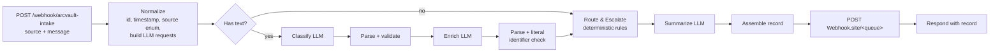

# Architecture

## 1. System design

- **Trigger.** An n8n Webhook node receives `{"source": "email|web_form|support_portal", "message": "..."}`. Email, form and portal integrations would all post to this one endpoint. One execution handles one message.
- **LLM steps (3 calls).** Each is a plain HTTP Request node calling Groq's OpenAI-compatible `/chat/completions`, followed by a Code node that validates the response. I used HTTP nodes rather than n8n's AI Agent nodes so the request body (model, temperature 0, JSON mode) is visible and reviewable. It also means the provider is just a base URL in config: Ollama or any OpenAI-compatible endpoint works without changing the workflow.
- **Decisions in code.** Routing and escalation are a pure function (`src/rules.js`) with unit tests, driven by `config/rules.json`. The LLM labels and extracts; code decides where a ticket goes. That way routing is deterministic, testable and explainable in an audit, and changing a threshold is a config edit, not a prompt change.
- **Where state lives.** The workflow keeps no state between messages. Each record lives in (1) the n8n execution history, which has every node's input and output for debugging, (2) Webhook.site, which stands in for the downstream queue: each record is POSTed to `/<destination_queue>` with `X-ArcVault-Queue` / `X-ArcVault-Escalated` headers, and (3) the webhook's HTTP response, which `scripts/send_samples.py` appends to `output/records.jsonl`. `output/records.json` is assembled from that file and validated against `schema/record.schema.json`. n8n Cloud has no local filesystem, so the brief's file output happens on the caller's side.
- **Single source of truth.** The workflow JSON is generated by `scripts/build_workflow.py` from `prompts/`, `config/rules.json` and `src/*.js`. The prompts in PROMPTS.md are generated from the same files. Nothing is edited by hand in the n8n UI except attaching the credential.

**Why n8n + Groq + gpt-oss-120b.** n8n is the brief's first-listed tool, it gives a visual demo, and the exported JSON is a required deliverable. Groq's free tier is fast (about 1 s per call). I intended to use `llama-3.3-70b-versatile`, but it isn't available to free-tier keys, so I used `openai/gpt-oss-120b`, the strongest model the key can access. It's a reasoning model; I set `reasoning_effort: low` because the tasks are short and latency matters more than deep reasoning. The constraint is the free tier's 8,000 tokens/minute, which is about one message per minute.

## 2. Routing

| Category | Standard queue | Why |
|---|---|---|
| Bug Report | `engineering` | Needs a code fix for a specific user or feature. |
| Incident/Outage | `incident_response` | Needs on-call/SRE, a different response time from a bug. |
| Billing Issue | `billing` | Finance can act on invoices; engineering can't. |
| Feature Request | `product` | Roadmap input, not a support ticket. |
| Technical Question | `technical_support` | How-to and configuration; usually answered from docs. |
| Anything escalated (section 3) | `human_review_escalation` | Fallback for low confidence and high-risk cases. |

Every record keeps both `standard_queue` (the owner based on category alone) and `destination_queue` (where it actually went), so the reviewer of an escalated ticket knows who to hand it to. I split Bug and Incident into separate queues, even though the brief's examples would allow one Engineering queue, because the Bug vs Incident boundary is the most important one for a support team: it decides whether someone gets paged.

## 3. Escalation

A record goes to `human_review_escalation` if **any** rule fires. Every rule that fired is recorded with a readable detail string.

| Rule | Fires when | Reasoning |
|---|---|---|
| `low_confidence` | classifier confidence < 0.70 | Required by the brief. The weakest of the rules, because self-reported confidence is poorly calibrated (see PROMPTS.md). |
| `multi_intent` | classifier lists `secondary_categories` | Added after testing: a three-request message scored 0.92 confidence. One ticket can't sit in two queues, so a human splits it. |
| `incident_category` | category is Incident/Outage | Outages are high-impact and time-critical; a person confirms scope before paging. |
| `outage_language` | phrase match on the raw text ("outage", "stopped loading", "multiple users affected", ...) | A safety net that doesn't depend on the LLM: an outage mislabelled as a Bug still escalates. Word-boundary matching, and deliberately no bare words like "everyone", to avoid false positives on feature requests. |
| `billing_amount_over_threshold` | Billing Issue and any $ amount in the text > $500 | See the interpretation note below. Amounts are parsed from the raw text by regex, not taken from the LLM, so a hallucinated number can't trigger or suppress it. |
| `llm_failure` | an LLM call failed or returned output that fails validation (after one retry) | Never drop a message. If classification failed, the standard queue is `unassigned`. If only enrichment failed, the standard queue is kept. |

**The $500 interpretation.** The brief says "billing error > $500". Message #3 has an invoice of $1,240 against a contract rate of $980, so the error itself is $260. I escalate when **any amount in the dispute** exceeds $500 (`billing_threshold_basis: "any_amount"`). A wrong invoice over $500 is a material financial document a person should check, and a customer disputing a $1,240 charge is a churn risk regardless of the difference. The alternative (`"discrepancy"`) is a one-line config change and is unit-tested; under it, #3 would go to `billing` unescalated. This is the decision I'd most expect a reviewer to push back on.

**Security signal: raises priority, doesn't escalate.** Access failures (401/403, "can't log in", "locked out") raise priority to High and are recorded in `advisory_signals`, but they don't escalate on their own. A single user getting a 403 (message #1) is routine engineering work, and escalating every login problem would flood the human queue. A mention of SSO in a question (message #4) is not a signal at all. If a login failure is widespread, the outage rules catch it.

**Priority** comes from the LLM. The only deterministic adjustment is the security signal above, and both `llm_priority` and `priority_adjusted_by` are recorded.

## 4. Failure handling

- LLM HTTP errors (429, 5xx, timeouts): the HTTP node retries once after 2 s, then continues with the error as data. The parse node turns it into `llm_failure`, which escalates. With JSON mode on, Groq returns an HTTP 400 (`json_validate_failed`) instead of malformed JSON, so "invalid JSON" is covered by the same retry. That's from memory of Groq's API; I didn't see it happen in my runs. If it slipped through, the parse node catches it anyway.
- Schema-invalid output (a category outside the list, confidence outside [0, 1]): not retried; escalated as `llm_failure` with the reason.
- An empty or whitespace-only message skips the classify and enrich LLM calls and is escalated.
- Summary failure falls back to a deterministic template, so the field is never empty.
- Hallucinated identifiers are dropped and listed in `dropped_identifiers`.

## 5. Evaluation results

Full table: [output/eval_report.md](../output/eval_report.md). I ran the 5 samples 3 times and the 8 edge cases once, against the live workflow, with prompts at v2.

- **5 samples: 15/15 runs match my pre-written expectations.** Category, priority, destination and escalation were **identical across all 3 runs**, and so was confidence (0.94/0.94/0.95/0.94/0.96). That's expected at temperature 0; it shows the output is repeatable, not that it's correct.
- **Edge cases: 6/8 pass.** Prompt injection was ignored (E3). French was classified correctly and escalated by the language-independent `incident_category` rule, since the English keywords didn't match (E4). Multi-intent was escalated (E1). An empty message was escalated without calling the classifier (E7). The long email was handled correctly (E8).
- **Failure 1, E2 "it's broken again":** Bug Report with confidence **0.78**, so it went to engineering without escalation. The same prompt family gave 0.62 in v1 testing, so the v2 changes moved confidence on a message they weren't aimed at. That is the clearest evidence here that self-reported confidence can't carry the fallback on its own.
- **Failure 2, E5 angry $45 billing:** High priority, driven by tone. It's still routed correctly (billing, not escalated). See CHANGELOG_PROMPTS.md.
- Latency inside n8n: median 2.0 s, max 4.1 s for the 3 LLM calls, measured by the workflow itself. It's about 4 s end to end from the client.

## 6. At production scale

- **Reliability:** put a durable queue (SQS, Pub/Sub or Redis Streams) in front of n8n so a burst or an n8n restart doesn't lose messages, with a dead-letter queue for records that fail twice. Deduplicate on a hash of source, sender and normalised text, since email clients and webhooks retry. Use exponential backoff that respects the provider's `retry-after`. Webhook.site would be replaced by the ticketing system's API, with idempotency keys.
- **Cost:** about 6k tokens per message across 3 calls. Merge classification and enrichment into one call (it sends the message once and drops one system prompt; my rough estimate is 30–40% fewer tokens, not measured), use a smaller model for classification once an eval set shows it's accurate enough, cache the static system prompts (prompt caching), and skip the summary LLM for categories where a template is enough.
- **Latency:** 2.0 s median inside n8n and about 4 s end to end today. Classification and enrichment are independent, so they can run in parallel (about 1 s saved). A paid tier removes the 8k tokens/minute ceiling, which is the real bottleneck now.
- **Observability:** log per-rule escalation rates, the category distribution, `llm_failure` rate, latency percentiles and token spend. A sudden jump in the escalation rate or in one category is the first sign of model drift or an outage.
- **Privacy:** customer messages go to a third-party LLM. For production I'd mask emails and phone numbers before the call, check the provider's data-retention terms, and set a retention period for n8n execution history, which stores the full text.

## 7. Phase 2 (one more week)

1. **Real ingestion:** Gmail/IMAP trigger and the support portal's API, including sender and account lookup so records carry a customer ID, not just what's in the text.
2. **Ticketing integration:** create Jira/Zendesk tickets in the destination queue, with the summary as the description and the escalation reasons as a comment.
3. **Confidence calibration:** a labelled set of about 300 real tickets. Replace self-reported confidence with self-consistency (agreement across N samples) or logprobs, and choose the threshold from measured precision and recall.
4. **Human feedback loop:** when a reviewer re-routes an escalated ticket, store the correction and add it to the eval set; re-run evals on every prompt change.
5. **Incident clustering:** many "dashboard not loading" messages within minutes should become one incident with linked reports, not N escalations.
6. **Multilingual:** the LLM already handled French (E4). The keyword rules are English-only, so the language-agnostic `incident_category` rule caught it. Phase 2 would detect the language, store it, and route to language-capable agents.
