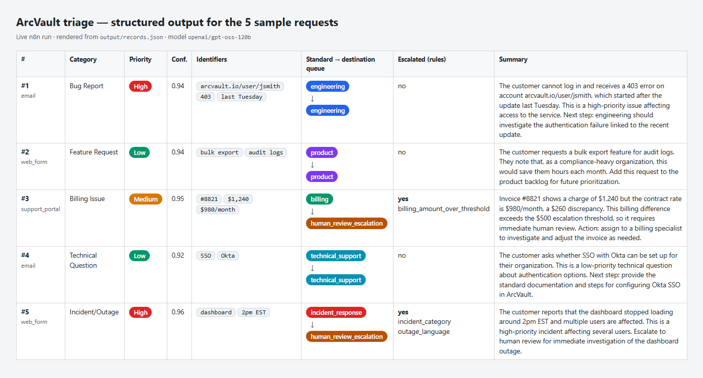
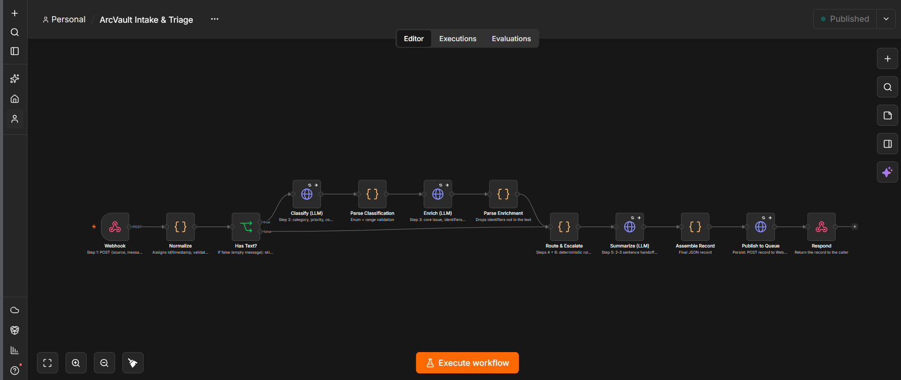

# Screenshots

## A. Step-by-step output for the 5 sample requests (generated)

These are rendered by `scripts/render_screenshots.py` from `output/records.json`, the records returned by the live n8n workflow. Every value shown comes from those records. Re-run the script after a new `send_samples.py` + `assemble_output.py` run to refresh them.

| File | Shows |
|---|---|
| [00-overview-all-samples.png](screenshots/00-overview-all-samples.png) | All 5 records in one table: category, priority, confidence, identifiers, standard to destination queue, escalation rules, summary |
| [sample1-steps.png](screenshots/sample1-steps.png) ... [sample5-steps.png](screenshots/sample5-steps.png) | One card per workflow step (ingestion, classification, enrichment, routing, escalation, structured output), labelled with the n8n node that produced it |
| [sample1-record-json.png](screenshots/sample1-record-json.png) ... [sample5-record-json.png](screenshots/sample5-record-json.png) | The complete final JSON record |

## B. n8n UI (captured in n8n Cloud)

These show that the workflow actually ran in n8n. They were taken by hand in a logged-in n8n Cloud session.

| File | Shows |
|---|---|
| [workflow.png](screenshots/workflow.png) | The published workflow canvas: all 12 nodes, including the empty-message branch from **Has Text?** |
| [n8n-02-executions.png](screenshots/n8n-02-executions.png) | Executions list: successful production runs, each about 4 s, with every node green |
| [n8n-03-sample3-route.png](screenshots/n8n-03-sample3-route.png) | Sample #3, **Route & Escalate** output: `standard_queue: billing`, `destination_queue: human_review_escalation`, `triggered_rules: billing_amount_over_threshold` |
| [n8n-04a-sample5-record.png](screenshots/n8n-04a-sample5-record.png), [n8n-04b-sample5-record.png](screenshots/n8n-04b-sample5-record.png) | Sample #5, **Assemble Record** output in two parts. `record_id` `1cd7d42b-…` is the same record as #5 in `output/records.json`. |

Not captured: the Webhook.site request list. Its URL is private to this setup, and the records it received are the same ones in `output/records.json`.
